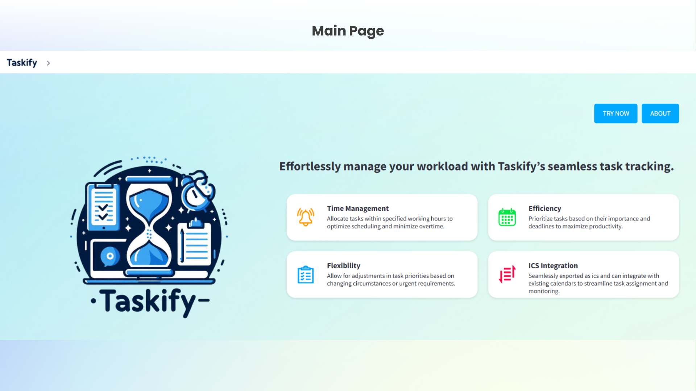
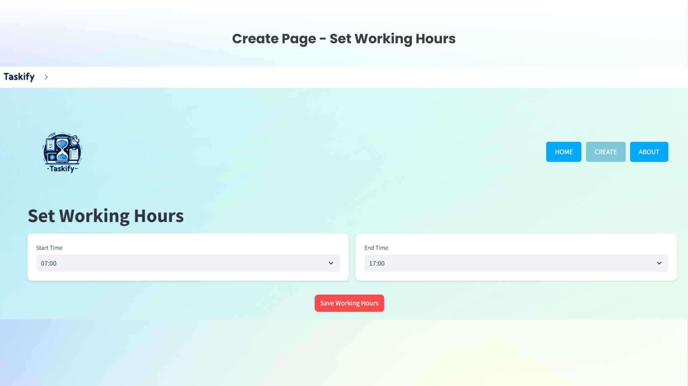
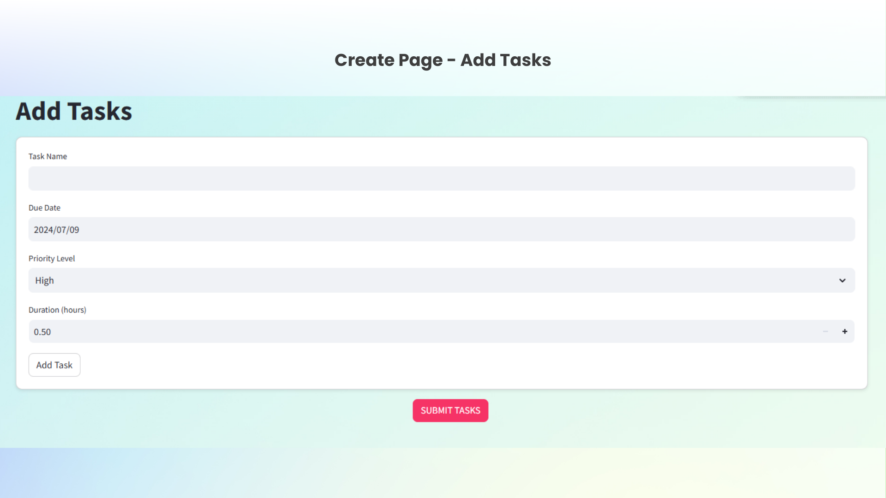
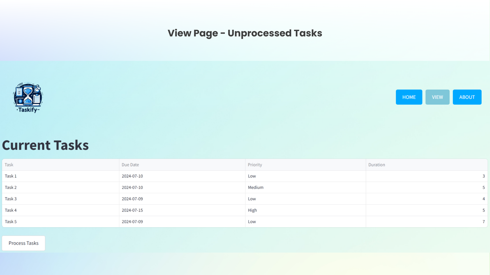
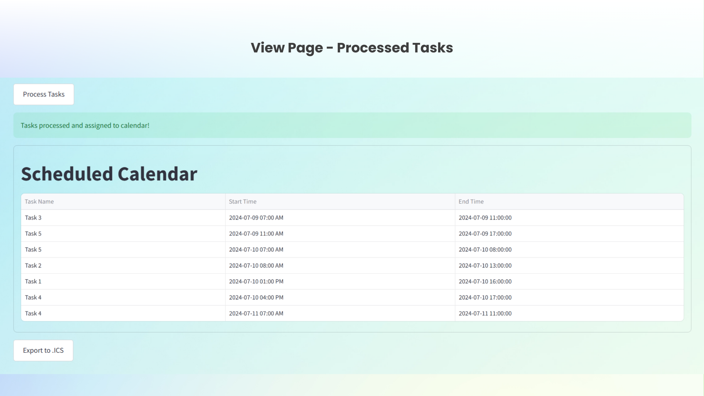
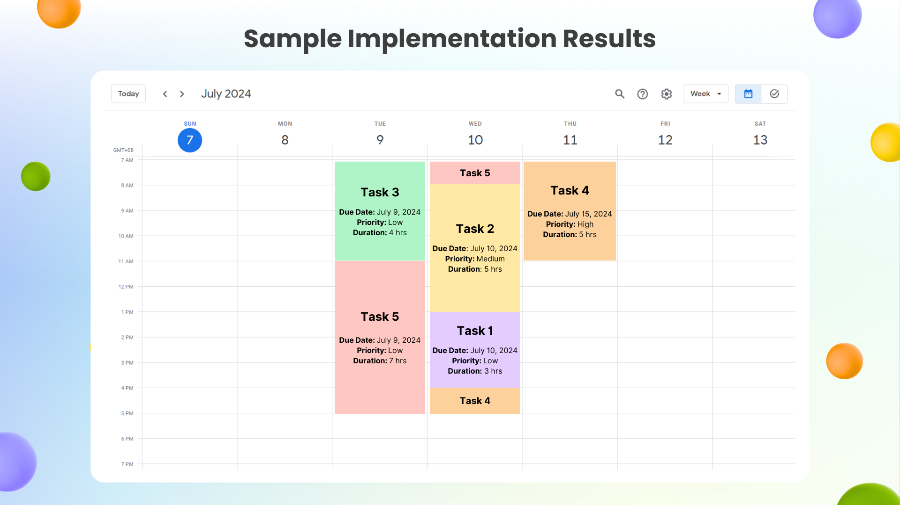

# Taskify 🗓️
 
---

A task scheduling application developed in partial fulfillment of the course **COSC 203: Design and Analysis of Algorithms**

## Table of Contents
- [Project Overview](#project-overview)
- [Live Site](#live-site)
- [Features](#features)
- [Screenshots](#screenshots)
- [Tech Stack](#tech-stack)
- [System Architecture](#system-architecture)
- [Run Locally](#run-locally)
- [Collaborators](#collaborators)
- [License](#license)
- [Acknowledgments](#acknowledgments)

## Project Overview

Taskify is a task scheduling tool that optimizes user task scheduling efficiency by implementing the Merge Sort algorithm for effective task prioritization. The application provides a user-friendly interface for managing tasks, setting working hours, and exporting schedules to calendar applications.

## Live Site
🔗 [View Live Site]()

## Features

- **Working Hours Management**: Set custom working hours to define available time slots
- **Task Management**: Add tasks with details like name, due date, priority, and duration 
- **Smart Scheduling**: Uses Merge Sort algorithm to prioritize tasks based on:
  - Due dates
  - Priority levels (High, Medium, Low)
- **Calendar Integration**: Export schedules as .ics files for use with external calendar applications
- **Task Splitting**: Automatically splits tasks across multiple available time slots if they exceed working hour

## Screenshots







## Tech Stack
- Frontend: Streamlit for UI development
- Backend: Python for task scheduling logic
- Calendar Integration: icalendar library for .ics file generation
- Version Control: Git and GitHub
- Deployment: Streamlit Cloud

## System Architecture

1. **User Input Interface**
   - Working hours configuration (start/end times)
   - Task input with validation
   - Visual task management

2. **Task Processing**
   - Merge Sort implementation for task prioritization
   - Primary sort by due date
   - Secondary sort by priority for same-day tasks

3. **Calendar Generation**
   - Automatic task scheduling within working hours
   - Smart task splitting across multiple days if needed
   - ICS file generation for calendar export

### Run Locally
Clone the Repository:

```bash
git clone https://github.com/lloydlegaspi/Taskify-DAA-Project.git
cd taskify
```

Install Dependencies:

```bash
pip install -r requirements.txt
```

Run the Application:

```bash
streamlit run Main.py
```

Access the Application:
Open your browser and navigate to the link provided in the terminal.

## Collaborators

- Doria, Chynna Mae V.
- Legaspi, John Lloyd S.
- Macaraeg, Paul Angelo O.
- Valoria, Kyla Mae N.

## License

This project is licensed under the MIT License. See the [LICENSE](LICENSE) file for details.

## Acknowledgments

Developed at the Polytechnic University of the Philippines' College of Computer and Information Sciences.
